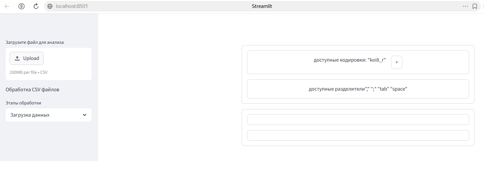

# Обработка и анализ произвольного CSV файла

### Описание

Данная программа предназначеа для обработки и анализа произвольных CSV файлов \
и формирования графиков (линейного, столбчатого, рассеяния).\
Функцианально программа разделена на 3 части/этапа:
- Выбор и загрузка CSV файла
- Предобработка CSV файла для анализа
- Построение графиков\
Первоначально доступен этап *Выбор и загрузка CSV файла*, каждый следующий этап доступен после завершения предыдущего.\
Экранная форма программы разделена на 2 части:
- Левая часть - Выбор файла и перемещение между этапами
- Правая часть - рабочая область выбранного этапа



Формула для расчета процентов с аннуитетным графиком:  
$$
x = S \times (P + \frac{P}{(1 + P)^N - 1})
$$

### Установка зависимостей

Установка всех зависимостей осуществляетсяв терминале командой:
```bash
pip install -r requirements.txt
```

### Запуск

Для запуска приложения наберите:
```bash
streamlit run app.py
```

### TODO
- [ ] добавить аутентификацию