# Обработка и анализ произвольного CSV файла

### Описание

Данная программа предназначена для обработки и анализа произвольных CSV файлов и формирования графиков (линейного, столбчатого, рассеяния).\
Функционально программа разделена на 3 части/этапа:
- Выбор и загрузка CSV файла
- Предобработка CSV файла для анализа
- Построение графиков

Первоначально доступен этап *Выбор и загрузка CSV файла*, каждый следующий этап доступен после завершения предыдущего.\
Экранная форма программы разделена на 2 части:
- Левая часть - Выбор файла и перемещение между этапами
- Правая часть - рабочая область выбранного этапа\
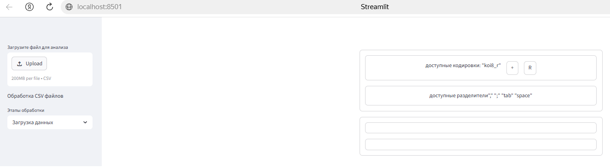
#### Выбор и загрузка CSV файла
Для выбора файла следует нажать кнопку Upload и выбрать нужный файл.\
После чего в рабочей области отобразятся возможные варианты загрузки.\
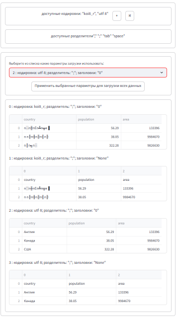\
В рабочей области будут отображены варианты открытия данного файла при разных параметрах (Кодировка, Разделители, Содержатся ли в открываемом файле названия столбцов).\
*Настройка параметров дат будет производиться на следующем этапе для каждого столбца отдельно.*\
***ВАЖНО:*** Будут отображены только те варианты, при которых в результате получается более 1 столбца.\
 По умолчанию в справочник кодировок загружена только кодировка *koi8-r*, данный справочник может 
быть дополнен пользователем, для этого надо ввести название кодировки в текстовое поле, которое откроется после 
нажатия на кнопку '+'. Остальные параметры в данной версии фиксированы и не подлежат изменению из приложения пользователем.\
***ВАЖНО:*** 
- На данном этапе не осуществляется проверка, допустима ли введенная кодировка. В случае, если введено ошибочное значение, 
при анализе файла в нижней части экрана будет выдано сообщение об ошибке и анализ будет остановлен. 
- Для возврата к начальному списку кодировок следует нажать 'R' 

После того, как будет получен подходящий по параметрам вид данных, в выпадающем списке следует установить нужную комбинацию и 
нажать кнопку "Применить выбранные параметры для загрузки всех данных"
После загрузки будет отображено количество загруженных строк и столбцов, с указанием названий, типов и количеством пустах значений по каждому столбцу.\
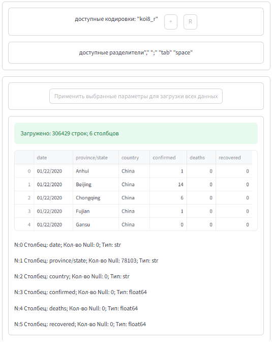\
В левом выпадающем списке появится "Предобработка данных"
#### Предобработка данных
*Предобработка данных* позволяет:
- изменить названия столбцов (особенно важно, когда в данных не было названий и были присвоены индексы столбцов)
- изменить тип столбца на строка/число/дата (особенно важно для дат)(проверка, что текущий тип не равен новому типу не реализована).
- Посмотреть статистику по каждому столбцу\
Стартовый экран этапа *Предобработка данных* выглядит следующим образом \
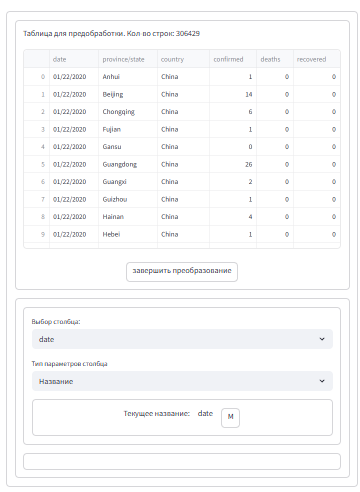\
В первом блоке отображается количество строк, текущие названия столбцов и данные.
Во втором блоке происходит работа с каждым столбцом.\
Активное поле выбирается из выпадающего списка.\
**Изменение названия**\
Данная операция доступна при выборе в списке *Тип параметров столбца* значения *Название*.\
Будет отображено текущее название и кнопка "М", после нажатия на которую появится поле для редактирования названия.\
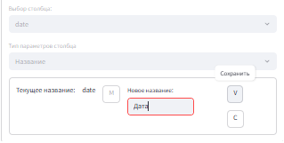\
После завершения редактирования следует нажать кнопку "V". Название столбца должно быть длиной от 1 символа. Осуществляется проверка, 
что новое название не повторяется. При построении графиков (в текущей версии *st.line_chart*, *st.bar_chart*, *st.scatter_chart*), 
если одно из названий данных содержит кавычки, график не отображается -  прямого запрета на наличие кавычек в названии нет, но, при наличии кавычек в названии, 
в верхней части первого блока *Предобработка данных* выдается предупреждение со списком столбцов.\
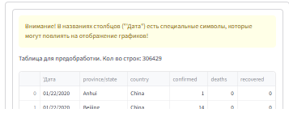\
**Изменение типа**\
Данная операция доступна при выборе в списке *Тип параметров столбца* значения *Изменение типа*.\
Будет отображен текущий тип и кнопка "М", после нажатия на которую появится список с возможными новыми типами (включая текущий тип). \
Общий порядок действий при изменении типа данных:
- Указать новый тип данных
- Нажать кнопку "Т" - протестировать\
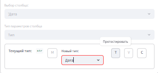
- будут выведены тестовые результаты преобразования\
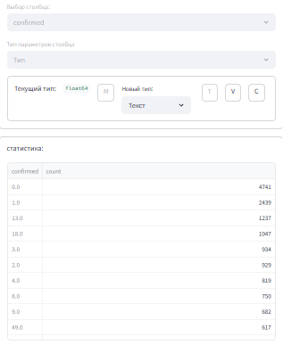\
- Если результат устраивает, следует нажать кнопку "V", для отказа - "C". В случае, если результат тестирования будет пустым 
и пользователь нажмет "V", данные в выбранном столбце будут обнулены.\
**Изменение типа на ДАТУ**\
При тестировании будут выведены 4 варианта конвертации значения в дату с разными параметрами\
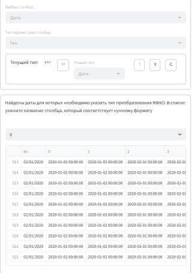\
В верхней части для изменяемого столбца определить на каком месте стоит день (значение больше 12)\
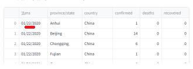\
и в выпадающем списке установить название столбца с нужным результатом\
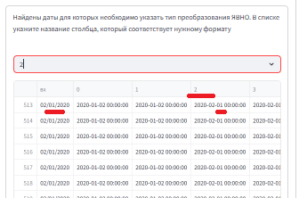\
и нажать кнопку "V". В процессе конвертации будет отображаться индикатор длительного процесса.\
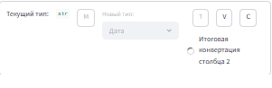\

**Статистика**\
Выбор пункта меню "*Статистика*" позволяет получить статистику по выбранному полю.\
Пример для числового столбца\
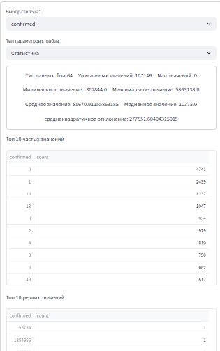\
Пример для текстового столбца\
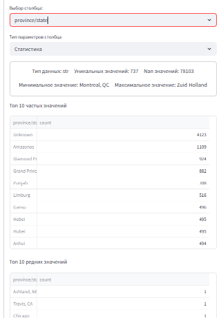\

**Завершение преобразования**\
Нажатие кнопки "*Завершить преобразование*" открывает в левом меню этап "*Графики*". 
При этом если изменить название или тип поля, этап "*Графики*" пропадет из левого меню.\

#### Графики
Данный пункт левого меню позволяет строить графики. В программе есть возможность построения 3 видов графиков.
Начальная форма имеет следующий вид\
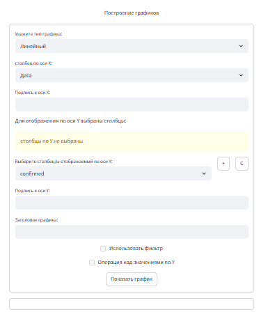\
**Тип графика:** можно выбрать одно из значений "*Линейный*", "*Рассеяния*", "*Столбчатый*"\
**столбец по оси Х:** указывается столбец с данными по оси Х. Для "*Столбчатого графика*" доступны для выбора все 
столбцы, для остальных типов графика только числовой или дата.\
**Подпись к оси Х:** указывается текст для оси Х.\
**Выберите столбец/ы отображаемые по оси Y:** можно задать 1 или несколько числовых столбцов.\
*в следующих версиях надо добавить тип дат и сделать проверку, что одновременно можно добавлять данные только одного типа, т.к. вывод, к примеру, стоимости и даты на одной шкале будет не очень корректным*\
В списке выбора отстутствует столбец из оси X.\
**Подпись к оси Y:** указывается текст для оси Y.\
**Загололвок графика:** указывается текст для шапки графика. Т.к. используется "штатный" график Streamlit,
в котором у графика нет заголовка, заголовок будет выведен над графиком.\
**Использовать фильтр:** позволяет отобрать для графика значения по одному полю, даже не отображаемому на графике.\
**Операция над значениями по Y:** позволяет применить функцию sum или mean к данным по оси Y. \
**Пример:**\
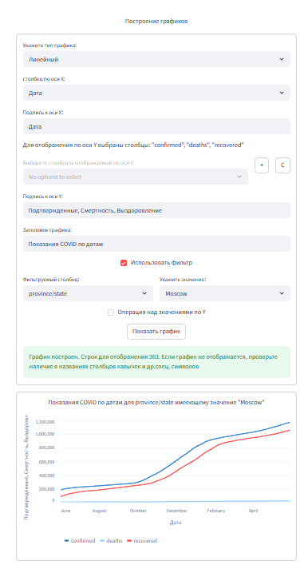\
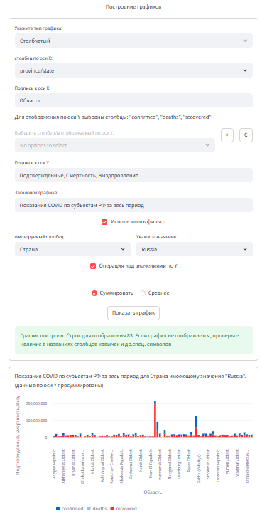\
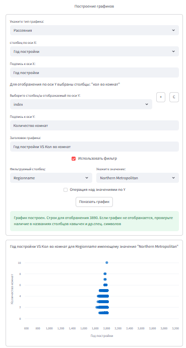\

### Установка зависимостей

Для работы программы требуется установить следующие библиотеки выполнив следующие команды в терминале:
```
pip install streamlit
pip install pandas
pip install numpy
```
Для установки Streamlit в ОС Windows в командной строке надо ввести
```
python -m pip install streamlit
```

### Запуск

Для запуска приложения наберите:
```bash
streamlit run app_2.py
```

### TODO
- [ ] доработать работу со справочником кодировок
- [ ] доработать условия фильтрации графиков
- [ ] в следующих версиях для графиков по Y надо добавить тип дат и сделать проверку, что одновременно можно добавлять данные только одного типа, т.к. вывод, к примеру, стоимости и даты на одной шкале будет не очень корректным
